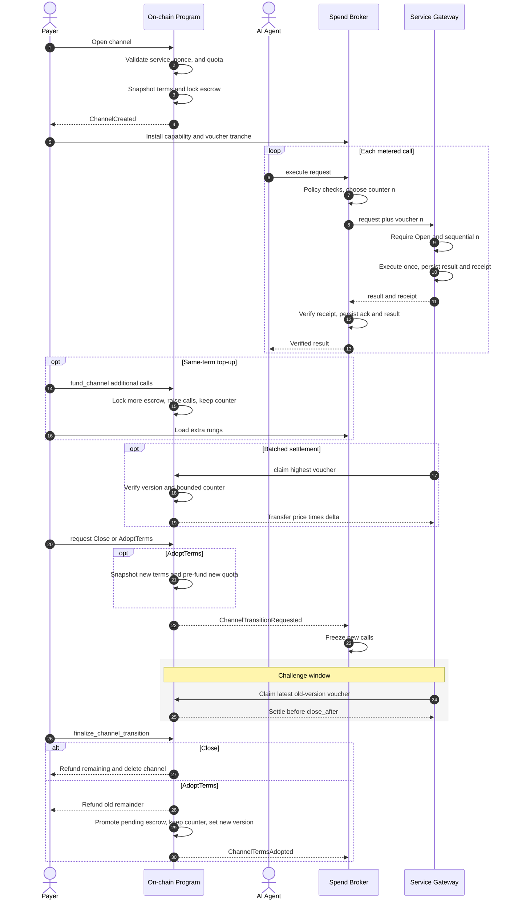

# Prepaid Call Channels for Metered Services

A chain-agnostic design for prepaid, unidirectional payment channels used to meter API / agent calls. Consumers lock funds once, consume off-chain with signed vouchers, and settle on-chain in batches. The on-chain program never sees individual calls.

This is a fit for agent-to-service payments: high call volume, small unit price, and a need to avoid a transaction per request.

---

## Problem

Metered services (LLM inference, tool APIs, agent runtimes) need:

1. **Prepayment** so the provider is not extending credit.
2. **Off-chain usage** so each call does not hit the chain.
3. **Trust-minimized settlement** so the provider can prove how many calls were consumed, and the consumer can recover unused funds.
4. **Price / terms changes** without silently applying new rates to already-funded channels.

A unidirectional prepaid channel with a monotonically increasing counter covers that set.

---

## Roles

| Role | Who | What they do |
|---|---|---|
| **Organization owner** | Provider business | Registers an organization, manages members, holds the org deposit. |
| **Service owner** | Org member | Publishes a priced service, receives claimed funds. |
| **Channel owner (payer)** | Human-controlled spend account | Opens nonce-isolated channels, funds them, signs vouchers through a broker/vault, and requests challenged close/AdoptTerms. |
| **Claimer** | Typically the service owner | Submits the latest signed voucher and withdraws earned funds. Anyone with a valid voucher can trigger a claim; payout always goes to the service owner. |

---

## On-chain objects

Three nested records, plus a program-owned escrow vault.

```
Organization
  └── Service          (priced offering, versioned)
        └── Channel    (payer prepaid quota against that service)
```

### Organization

A named provider entity.

| Field | Meaning |
|---|---|
| `id` | Deterministic hash of `(domain, owner, name)` |
| `owner` | Account that created it |
| `name` | Unique per owner |
| `members` | Count of member accounts |
| `services` | Count of published services |
| `paused` | Admission hold: no new services/channels/`AdoptTerms` under the org |
| `metadata` | Arbitrary blob (endpoint, docs, branding) |

Creating an organization **reserves a deposit** from the owner (anti-spam). The deposit is returned on delete. Members are stored as `(organization_id, account) → rank`. Rank `0` is the owner; other members start at rank `1`. Only members may create services under the org. The owner may `set_organization_paused` to stop new admission while existing channels drain; delete still requires `services == 0`.

IDs are content-addressed. Two owners can reuse the same display name; collisions under one owner are rejected.

### Service

A priced, versioned offering.

| Field | Meaning |
|---|---|
| `id` | Deterministic hash of `(domain, owner, name)` |
| `owner` | Account that receives claims |
| `org_owner` | Parent organization owner (lookup key) |
| `receipt_signer` | Provider/gateway key whose delivery receipts the spend broker accepts |
| `organization` | Parent org id |
| `name` | Unique per organization |
| `version` | Starts at `1`; increments on every update |
| `asset` | Immutable payment asset for the service |
| `price` | Unit price **per call** |
| `minimum_calls` | Floor on prepaid quota when opening / adopting new terms |
| `expiration_threshold` | Channel lifetime, in chain time units (blocks / slots) |
| `trials` | Reserved for a free-trial quota (not enforced in the current logic) |
| `channels` | Count of open channels against this service |
| `paused` | Admission hold: no new channels / `AdoptTerms` for this service |
| `metadata` | Arbitrary blob (schema, model id, rate-limit hints) |

Updating a service **always bumps `version`**. Open channels keep their snapshot; new terms apply only after a challenged AdoptTerms (see [Service versioning](#service-versioning)). Same-term extra quota is `fund_channel`. `set_service_paused` (or a parent org pause) stops new channels and AdoptTerms without bumping `version`.

### Channel

A prepaid escrow from one payer to one service. A protocol-assigned monotonic payer `nonce` permits a separate channel per agent/task.

| Field | Meaning |
|---|---|
| `id` | Deterministic hash of `(deployment domain, payer, organization_id, service_id, nonce)` |
| `owner` | Payer |
| `nonce` | `NextChannelNonce[payer]`; protocol increments it on every open |
| `organization` / `service` | Target |
| `version` / `asset` / `receipt_signer` | Service terms snapshotted at open / AdoptTerms |
| `price` | Unit price snapshotted at open / AdoptTerms |
| `calls` | Prepaid ceiling (grows on `fund_channel` / AdoptTerms) |
| `counter` | Highest settled call count (starts at `0`; never resets) |
| `expiration` | Refreshed on fund / AdoptTerms |
| `status` | `Open` or `Closing { close_after, Close | AdoptTerms }` |

Locked amount at open (and again at each fund, for the added calls only):

```
funds = channel.price × channel.calls          // total prepaid at current snapshot
```

Unsettled remainder at any time:

```
require 0 ≤ channel.counter ≤ channel.calls
remaining = checked_mul(channel.price, channel.calls − channel.counter)
```

All arithmetic is checked; overflow/underflow aborts atomically. Later service updates do not rewrite the active snapshot. New terms apply only after a challenged AdoptTerms. `counter` never resets, so an already-settled voucher pays zero if resubmitted.

### Escrow vault

Each channel/asset has an isolated program-owned escrow. A pooled-balance implementation must enforce identical per-channel liabilities and aggregate conservation. Opens and `fund_channel` transfer in; claims and finalized transitions transfer out.

---

## Identity and domain separation

Every hash uses canonical encoding and a deployment domain containing protocol version, chain id, and program/contract id.

```
domain     = encode("apc", protocol_version, chain_id, program_id)
org_id     = H( domain || "org" || owner || len(name) || name )
service_id = H( domain || "svc" || owner || len(name) || name )
channel_id = H( domain || "ch" || payer || org_id || service_id || nonce )

voucher    = H( domain || "voucher" || channel_id
                || channel.version || counter )
```

`H` is a 256-bit cryptographic hash. Integers are fixed-width little-endian; variable bytes are length-prefixed. Each deployment supports one exact signature convention over the raw digest—no alternate wrappers.

---

## Lifecycle

```
create organization
        │
        ▼
create service ───────────────────────────────► update service (version++)
        │                                              │
        ▼                                              │ broker freezes stale snapshot
open channel(nonce)                                    │
lock asset/price × calls                               │
        │                                              │
        ├── fund_channel: same terms, calls += N       │
        ├── broker/provider off-chain calls + receipts │
        ├── provider claims cumulative vouchers        │
        │                                              ▼
        └── payer requests Close or AdoptTerms ─► status=Closing
                                                       │ challenge window:
                                                       │ provider settles old version
                                                       ▼
                                              finalize transition
                                              ├── Close: refund remainder
                                              └── AdoptTerms: keep counter,
                                                  snapshot/re-lock new remaining quota
```

## Sequence



### 1. Open

Payer supplies the current `NextChannelNonce[payer]` and call quota `N`.

Checks:

- Service exists and neither the service nor its organization is paused.
- `N ≥ service.minimum_calls`.
- `nonce == NextChannelNonce[payer]`; successful open increments it, so ids cannot repeat.

Effects:

- Transfer checked `service.price × N` of `service.asset` to channel escrow.
- Snapshot version, asset, receipt signer, price, `calls=N`, `counter=0`, `status=Open`.
- Set `expiration = now + service.expiration_threshold`.
- Increment `service.channels`.

### 2. Off-chain consumption (the actual “channel”)

For each broker-authorized call, the payer provides a **replaceable IOU** over

```
(domain, channel_id, channel.version, counter)
```

`counter` is **cumulative** and never resets. After 17 billed calls the voucher is `counter = 17`, not 17 separate signatures of `1`. After a later top-up, the next voucher is `18`, not `1` again. The provider keeps only the highest-counter signature. Older vouchers are worthless (a resubmit of an already-settled `n` is a zero claim).

This is a classic unidirectional payment channel:

- The payer cannot decrease the counter (on-chain claim requires `n ≥ channel.counter`, and `n < channel.counter` rejects).
- The provider cannot invent a higher counter without the payer's signature.
- Settlement cost is one on-chain claim for any number of calls.

The signed version is the channel snapshot, not live service terms. A service update freezes new broker calls. Outstanding vouchers remain claimable during the transition challenge; AdoptTerms snapshots new terms and continues `counter`.

For agents, the spend broker—not the agent—holds vouchers. It accepts a provider response only when the receipt binds channel snapshots, counter, request hash, and result hash. See [AGENTIC.md](AGENTIC.md) and [pseudo/v0/07-offchain.md](../pseudo/v0/07-offchain.md).

### 3. Claim

Anyone may submit `(channel, counter, signature)`.

Payout always goes to **`service.owner`**, not the transaction sender.

Path A — **exhausted cleanup**:

- If remaining is zero, clean up the channel without a signature (unless AdoptTerms is pending).

Path B — **voucher settlement**:

- `0 < counter ≤ channel.calls`.
- Signature verifies over `(domain, channel_id, channel.version, counter)`.
- If `counter == channel.counter`, return with no transfer (idempotent zero claim).
- If `counter > channel.counter`, `claim = checked_mul(channel.price, counter − channel.counter)`.
- Transfer `claim` from escrow to `service.owner`.
- Persist the new counter atomically.

Claims work while `Open` or `Closing`, including after expiry/version change, until transition finalization. There is no cap-and-continue for `counter > calls`: reject it.

Claims are **incremental**. The provider can cash out every few calls, or wait and submit the latest voucher once.

### 4. Same-term fund vs challenged close / AdoptTerms

**`fund_channel(additional_calls)`** is the top-up path. Live `service.version` must still match the channel snapshot. It locks `price × additional_calls`, raises `calls`, keeps `counter`, and may extend expiration. No freeze, no challenge. The pre-signed ladder is append-only (`old_calls+1 … new_calls`).

Immediate **refunds** and **re-prices** are unsafe because an unclaimed voucher may exist. Those use a challenge:

1. Payer calls `request_channel_transition(Close | AdoptTerms { calls })`.
   - `AdoptTerms` requires `service.version != channel.version`. It snapshots live terms and pre-funds a new remaining quota (`calls` extra calls after the current counter) in this owner-signed transaction.
2. Channel becomes `Closing`; broker/provider stop new calls.
3. Until `close_after = now + CLOSE_CHALLENGE_PERIOD`, provider may settle the latest old-version voucher.
4. Anyone may finalize after the deadline without debiting the payer:
   - **Close:** refund latest `remaining` and delete channel; monotonic nonce prevents reopening that id.
   - **AdoptTerms:** refund old remaining, promote pre-funded pending escrow, snapshot new terms, set `calls = counter + pending.calls`, **keep `counter`**, return to `Open`.

Payer may cancel before finalization and recover pending funds. If pre-funding fails, the request rolls back and channel stays `Open`. The channel id stays stable. Old-version vouchers no longer verify after AdoptTerms; new rungs continue from `counter + 1`. `AdoptTerms` is rejected while the org or service is paused; `Close` is not.

### 5. Pause, then delete

Deletes are **rejected** while children exist, so escrow cannot be frozen against a missing service:

- `delete_service` requires `service.channels == 0`.
- `delete_organization` requires `organization.services == 0` (hence all channels already gone).

**Pause** is the wind-down switch. It does not seize escrow or bump `version`.

| Hold | Who | Blocks | Still allowed |
|---|---|---|---|
| `set_service_paused(true)` | Service owner | `open_channel`, `AdoptTerms` | Existing Open calls, `fund_channel`, claims, Close |
| `set_organization_paused(true)` | Org owner | `create_service`, plus the above for every service | Same as above, org-wide |

To shut down an organization: pause it, let payers exhaust or Close channels, delete empty services, then `delete_organization`. Unpause with `paused = false`.

Close every channel via claim/refund first, then delete service, then delete org.

---

## Service versioning

`update_service` is a **hard cut** for *new* terms, not a wipe of in-flight IOUs. Any change — name, price, minimum calls, expiry window, trials, metadata — increments `version`. Open channels keep their snapshot.

Consequences:

| Actor | After a version bump |
|---|---|
| Provider | Outstanding old-version vouchers settle at channel snapshots during the challenge. Cannot apply new price/asset/key to old IOUs. |
| Payer | Requests Close or AdoptTerms; no immediate refund. `fund_channel` is rejected until versions match. |
| Payer who wants to continue | Finalized AdoptTerms snapshots current terms, sets `calls = counter + new_quota`, and keeps `counter`. |

This keeps prepaid rates honest without burning signed work or racing an immediate refund. Version, not a reset counter, is what stops an old IOU from paying again at new terms.

---

## Time and refunds

Channels are not infinite. `expiration` is set at open and refreshed on `fund_channel` / AdoptTerms using `service.expiration_threshold`.

Expiry or a snapshot mismatch freezes new off-chain calls and is a reason to request a transition. It does not immediately move funds. Same-term `fund_channel` may extend expiration without a challenge.

After a transition request, the challenge deadline is the provider's deterministic final settlement window. Finalization computes refund from the latest on-chain counter. Providers still claim periodically and react to transition events with a safety margin.

---

## Economic parameters (suggested)

These were used in the reference implementation and are knobs, not protocol invariants.

| Parameter | Role |
|---|---|
| Organization deposit | Anti-spam for org creation; returned on delete. |
| Service deposit | Anti-spam for service creation; returned on delete. |
| Max name / metadata length | Bound storage. |
| Max organization members | Enforced at org create (owner counts as 1). |
| `minimum_calls` | Prevents dust channels that cost more to settle than they hold (open / AdoptTerms). |
| `expiration_threshold` | Provider claim window vs. payer capital lockup. |
| `CLOSE_CHALLENGE_PERIOD` | Non-zero final settlement window before refund / AdoptTerms. |

`trials` is stored on the service but is not billed in v0 (intended as a free-call allowance before the counter starts billing).

---

## What stays off-chain

The chain does **not** record individual calls, request payloads, or API keys. Off-chain components that a Solana (or any other) implementation still needs:

1. **Spend broker** — agent sends intended request; broker chooses/attaches voucher and never exposes it.
2. **Provider receipts** — receipt binds deployment, channel version, counter, request hash, and result hash. Broker verifies and persists before returning result.
3. **Idempotency** — provider stores result+receipt+highest voucher by `(channel, counter)`; broker retries the same outstanding counter after network loss.
4. **Provider accounting** — accept only `counter+1` for the current Open version.
5. **Watchers** — provider reacts to transition requests before `close_after`; payer/broker funds, requests, and finalizes transitions.
6. **Discovery** — metadata advertises endpoints; the owner-controlled on-chain `receipt_signer` supplies authority.

Receipts attest request/result bytes, not semantic correctness. v0 assumes an honest provider or trusted gateway; stronger delivery assurance is an optional bond/dispute, TEE, or verifiable-computation layer.

---

## Invariants (for a port)

A port to Solana (or any other chain) should preserve these, regardless of account layout:

1. **Nonce-isolated identity.** Id is `(deployment, payer, org, service, nonce)`; used ids cannot reopen.
2. **Escrow conservation.** Active escrow equals checked `price × (calls − counter)`; pending AdoptTerms escrow separately equals its snapshotted `funds`.
3. **Bounded monotonic counter.** `0 ≤ counter ≤ calls`; only a valid payer voucher increases it; it never resets.
4. **Snapshotted price.** Claims use `channel.price`, never the live `service.price`.
5. **Version-bound vouchers.** Signed version equals the channel snapshot.
6. **Challenged transitions.** No refund / AdoptTerms before non-zero challenge deadline; claims stay valid while Closing. Same-term `fund_channel` has no challenge.
7. **Claim payout to `service.owner`**, independent of who submits the tx.
8. **Service update always increments version** (no silent field edits).
9. **No delete while children exist.** `delete_service` iff `channels == 0`; `delete_organization` iff `services == 0`.
10. **Explicit asset.** Service asset is immutable; channel/escrow snapshot it.
11. **Atomic checked state.** Overflow, underflow, transfer failure, wrong asset, or invalid signature changes nothing.
12. **Monotonic quota.** `fund_channel` raises `calls` at the current snapshot. Finalized AdoptTerms sets `calls = counter + new_quota` and keeps `counter`.
13. **Admission pause.** Org or service `paused` blocks `create_service`, `open_channel`, and `AdoptTerms` only. It does not bump `version` or move funds.

---

## Mapping notes for Solana

Not required to understand the model; useful when implementing.

| Concept here | Typical Solana shape |
|---|---|
| Program-owned escrow | PDA / token account **per channel + asset** |
| Organization / service / channel records | PDAs: `["org", owner, name]`, `["svc", org, name]`, `["ch", payer, org, svc, nonce]` |
| Reserved deposits | Token accounts or lamport holds on those PDAs |
| `block_number + threshold` | `Clock::get().slot` (or unix timestamp) + configured TTL |
| Payer signature over voucher | Ed25519 via `sysvar::instructions` (verify in-program) or a signed off-chain message checked with `ed25519_program` |
| Asset | Immutable `service.asset`; channel escrow token account uses that mint (or explicit native asset id) |
| Events | Anchor events / program logs for indexers |

The voucher schema stays portable, while the deployment domain prevents replay across chains/programs:

```
sign(H(domain || "voucher" || channel_id
       || channel.version || counter))
```

`domain = encode("apc", v0, chain_id, program_id)`. Publish golden vectors for every implementation language.

---

## Security notes for implementers

- **Do not settle at live price.** Always use the snapshotted `channel.price`.
- **Bind vouchers to deployment + channel version.**
- **Reject `counter > calls`.** Do not cap and continue.
- **Never reset `counter`.** Same-term top-up raises `calls`; terms change continues from the latest settled `n`.
- **Use checked arithmetic and atomic state/transfers.** Never saturate.
- **Never reuse a channel nonce/id.** Protocol-assigned `NextChannelNonce[payer]` only increases.
- **Use challenged close / AdoptTerms.** Immediate refunds or in-place re-prices can steal from an unclaimed voucher.
- **Refuse delete while children exist.** Otherwise claim/refund cannot load `service.owner` and funds freeze. Pause first to stop new admission.
- **Pause is admission-only.** It does not bump `version`, seize escrow, or cancel prepaid calls.
- **Keep asset explicit and immutable** for each service.
- **Anyone-can-submit claims** is intentional (relayer-friendly) only if payout is hardcoded to `service.owner`.
- **One canonical raw-digest signature convention.** Do not accept alternate wrapping.

---

## Minimal instruction set

A complete port needs roughly these instructions:

| Instruction | Caller | Purpose |
|---|---|---|
| `create_organization` | future owner | Register org, lock deposit, add members |
| `set_organization_paused` | owner | Block new services/channels/AdoptTerms under the org |
| `delete_organization` | owner | Remove org, return deposit (requires `services == 0`) |
| `create_service` | org member | Publish priced service, lock deposit |
| `update_service` | service owner | Edit terms, bump version (does not rewrite channels) |
| `set_service_paused` | service owner | Block new channels / AdoptTerms for this service |
| `delete_service` | service owner | Remove service, return deposit (requires `channels == 0`) |
| `open_channel` | payer | Lock asset/price × calls under next payer nonce |
| `fund_channel` | payer | Same-term top-up: raise `calls`, keep `counter` |
| `request_channel_transition` | payer | Start challenged Close or AdoptTerms |
| `cancel_channel_transition` | payer | Reopen before finalization |
| `finalize_channel_transition` | anyone | Close/refund or adopt new terms after deadline |
| `claim_channel_funds` | anyone | Settle snapshot-bound voucher / exhausted cleanup |

That is the whole on-chain surface. Everything else is off-chain protocol around the voucher.

---

## Open for v1

Not in v0. Do not invent these during the first port:

- Add/remove members after org create; transfer org or service ownership (rank is unused beyond owner vs member).
- Bill `trials` as a free-call allowance before `counter` starts.
- Optional provider bonds/disputes, TEEs, or verifiable computation for stronger delivery assurance.
